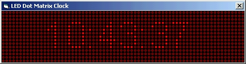



## Dot Matrix control

### Description

I used the idea of Michael Hammond, Dot Matrix clock, and made a control out of it. Right now, you have the choice of 4 colors, of course you can add some yourself. You can change the font. The width of the control is ajustable but the height will automatically adjust to the height of one line of text depending on the font you choose. Tell me what you think.
 
### More Info
 

             |
---                |---
**Submitted On**   |2005-02-01 17:38:26
**By**             |[Frédéric Côté](https://github.com/Planet-Source-Code/PSCIndex/blob/master/ByAuthor/fr-d-ric-c-t.md)
**Level**          |Intermediate
**User Rating**    |5.0 (25 globes from 5 users)
**Compatibility**  |VB 6\.0
**Category**       |[Custom Controls/ Forms/  Menus](https://github.com/Planet-Source-Code/PSCIndex/blob/master/ByCategory/custom-controls-forms-menus__1-4.md)
**World**          |[Visual Basic](https://github.com/Planet-Source-Code/PSCIndex/blob/master/ByWorld/visual-basic.md)
**Archive File**   |[Dot\_Matrix184688212005\.zip](https://github.com/Planet-Source-Code/fr-d-ric-c-t-dot-matrix-control__1-58610/archive/master.zip)

